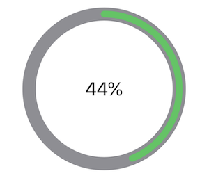
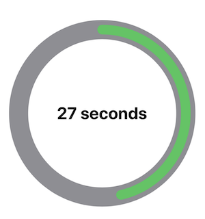

## UICircularProgressRing

<p align="center">

</p>

UICircularProgress ring is a library for rendering circular progress rings and timers.

- **Declarative:** Written using [SwiftUI](https://developer.apple.com/xcode/swiftui/) (*legacy UIKit version available*), UICircularProgressRing is declarative making it easy to read, and easy to use.
- **Customizable:** Designed to be used in production, all of the views are highly customizable without giving up ease of use. This allows the developer to tailor the look, feel and functionality to fit their needs.
- **Tested:** Battle tested in many [production applications](#apps-using-uicircularprogressring). UICircularProgressRing is also fully unit tested as well as snapshot tested so developers can feel safe.
- **Documented:** UICircularProgressRing's public API is 100% documented and its something that is enforced before any code is ever added. This is a resource that will help any new user understand how to get the most out of this library.

## iOS 14+ Note

Since Apple has now added a built in [ProgressView](https://developer.apple.com/documentation/swiftui/progressview) the need for this library is about to be over. My recommendation: If you can support iOS 14.0 and use the new system `ProgressView` then you should use that. This library will be continued to be maintained (critical bugs will be fixed, etc) but no new features are planned as we are reaching EOL for this library.

## Installation

UICircularProgressRing is available in two major versions. The latest version **v7.0+** or legacy versions. The legacy version is written using UIKit and requires a deployment target of `iOS 8.0+` or `tvOS 10.0+`. The latest version is written in SwiftUI and requires `iOS 13.0+`, `macOS 15.0+`, `tvOS 13.0+` or `WatchOS 2.0+`.

For legacy installation, [follow these](./LegacyREADME.md) instructions.

### Swift Package Manager

Simply add this library to your package manifest or follow instructions on adding a package dependency [using Xcode here](https://developer.apple.com/documentation/xcode/adding_package_dependencies_to_your_app).

```swift
.package(
    url: "https://github.com/luispadron/UICircularProgressRing.git",
    .branch("master")
)
```

## Documentation

This projects public API is 100% documented and it's something we spend a lot of time working on. Please make sure to read the documentation before opening any issues, questions, etc.

[Read the documentation 📖](https://htmlpreview.github.io/?https://github.com/luispadron/UICircularProgressRing/blob/master/docs/index.html)

## Usage

### ProgressRing

`ProgressRing` is a view designed to display some kind of progress, this can be anything which is represented as a percentage in the range `[0, ∞)`. A percentage is represented in decimal format, i.e. `0.5` is `50%`. Progress may be a downloading operation, the grade percentage of a users test score, etc. A short example of using `ProgressRing` is shown below, for more details [read the docs](#documentation) or play with the [example app](/Example/).

```swift
struct ProgressRingExample: View {
    @State var progress = RingProgress.percent(0.44)

    var body: some View {
        VStack {
            ProgressRing(
                progress: $progress,
                axis: .top,
                clockwise: true,
                outerRingStyle: .init(
                    color: .color(.gray),
                    strokeStyle: .init(lineWidth: 20)
                ),
                innerRingStyle: .init(
                    color: .color(.green),
                    strokeStyle: .init(lineWidth: 10),
                    padding: 5
                )
            )
                .animation(.easeInOut(duration: 5))
                .padding(32)
        }
    }
}
```



### TimerRing

`TimerRing` is a view designed to display time. You initialize the timer by giving it a unit of time and duration, for example: `.seconds(60)`. This means the `TimerRing` will run for 60 seconds, filling up the inner ring until finally reaching 100% around the entire outer ring.
A short example of using `TimerRing` is shown below, for more details [read the docs](#documentation) or play with the [example app](/Example/).

```swift
struct TimerRingExample: View {
    @State var isPaused = false
    @State var isDone = false

    var body: some View {
        TimerRing(
            time: .minutes(1),
            delay: .seconds(0.5),
            innerRingStyle: .init(
                color: .color(.green),
                strokeStyle: .init(lineWidth: 16),
                padding: 8
            ),
            isPaused: $isTimerPaused,
            isDone: $isTimerDone
        ) { currentTime in
            Text(timeFormatter.string(from: currentTime))
                .font(.title)
                .bold()
        }
    }
}
```



## Examples

- [Loading/Spinner](./Example/UICircularProgressRingExample/Examples/IndeterminateExample.swift)
- [Networking](./Example/UICircularProgressRingExample/Examples/NetworkingProgressExample.swift)

## Apps Using UICircularProgressRing

- [GradePoint](http://gradepoint.luispadron.com) by Luis Padron.
- [UVI Mate](https://itunes.apple.com/us/app/uvi-mate-global-uv-indethex-now/id1207745216?mt=8) by Alexander Ershov.
- [HotelTonight](https://itunes.apple.com/app/id407690035?mt=8) by Hotel Tonight Inc.
- [הנתיב המהיר](https://itunes.apple.com/us/app/הנתיב-המהיר/id1320456872?mt=8) by Elad Hayun
- [Nyx Nightclub Management](https://itunes.apple.com/dk/app/nyx-nightclub-management-ipad/id954874082?mt=8) by Nyx Systems IVS
- [Barstool Sports](https://itunes.apple.com/us/app/barstool-sports/id456805313) by Barstool Sports
- [88 Days](http://88-days.com) by Stijn Kramer
- [Bookbot](https://www.bookbotkids.com) by Bookbot
- [car2go](https://apps.apple.com/us/app/car2go/id514921710) by car2go Group GmbH